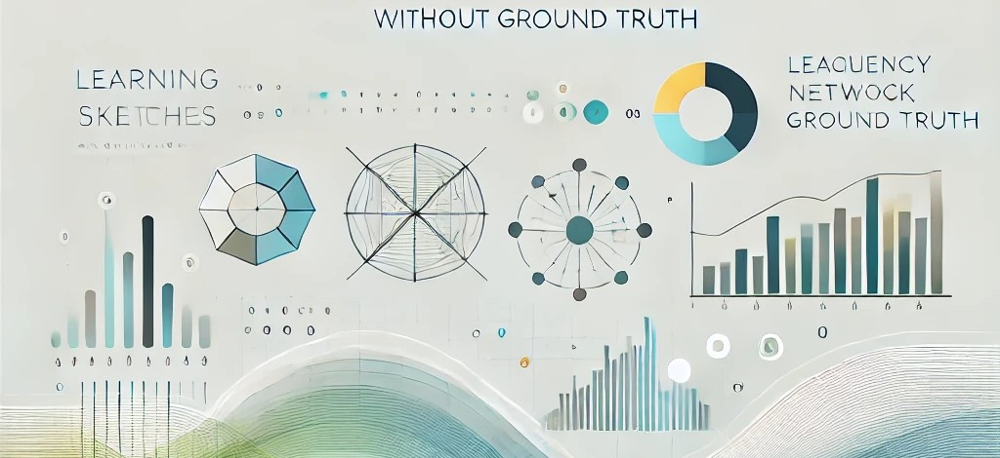
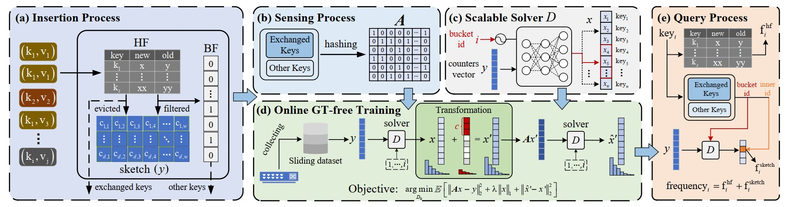

# Unsupervised Compressive Learning Sketch (UCL-sketch)<br><sub>Official PyTorch Implementation</sub>

<div align="center">
<p>

[](https://github.com/Y-debug-sys/UCL-sketch/stargazers)
[](https://github.com/Y-debug-sys/UCL-sketch/network) 
[](https://github.com/Y-debug-sys/UCL-sketch/blob/master/LICENSE) 


</p>
</div>

<p align="center">

<br>
<b>Fig. 1:</b> Learning-based Sketches for Frequency Estimation in Data Streams without Ground Truth (from Chat-GPT).
</p>

> **Learning-based Sketches for Frequency Estimation in Data Streams without Ground Truth**\
> Authors: [Xinyu Yuan](https://y-debug-sys.github.io/), [Yan Qiao](https://faculty.hfut.edu.cn/qiaoyan/en/index.htm)*, [Meng Li](https://ubiplab.github.io/MengLi_CV.github.io/) et al.\
> Paper: http://arxiv.org/abs/2412.03611

## About
This work addresses the challenge of frequency estimation in unending data streams, which is vital across domains such as networking, social media, and finance. Traditional sketch-based approaches, using compact counters and hash functions, are computationally efficient but often sacrifice accuracy. Recent efforts to enhance sketches with deep learning have shown promise in improving performance but face limitations: reliance on labeled data, frequent retraining requirements, and high time and space costs in streaming scenarios. 

To overcomethese limitations, the study introduces **UCL-sketch** (**U**nsupervised **C**ompressive Learning **Sketch**), a novel framework combining the strengths of equation-based and learned sketches. Unlike prior approaches, UCL-sketch is ground-truth-free, relying on self-supervised strategy called equivalent learning using only sketch counters for online training. This enables real-time adaptation to distribution shifts in streaming data. The framework also incorporates logical buckets, allowing scalable and efficient handling of large-scale streams by splitting and learning multiple mappings with shared parameters.

<p align="center">

<br>
<b>Fig. 2:</b> Overview of Our Stream Data Sketching Framework.
</p>

This repository contains:

* 🪐 A simple PyTorch [implementation](https://github.com/Y-debug-sys/UCL-sketch/tree/master/UCL_sketch) of UCL-sketch.
* ⚡️ Pre-processed 13-byte long 5-tuple network packet data slices.
* 💥 A self-contained [jupyter notebook](https://github.com/Y-debug-sys/UCL-sketch/blob/master/experiment_demo.ipynb) for running and evaluating all sketching algorithms: *CM-sketch*, *C-sketch*, *Ideally Learned CM-sketch*, *Ideally Learned C-sketch*, *Univmon*, *Elastic Sketch*, *NitroSketch*, *SeqSketch* and our *UCL-sketch* for sure.
* 🛸 Other useful functions and documents, such as metrics like Weighted Mean
Relative Difference (WMRD).

## Setup

First, download and set up the repo:

```bash
git clone https://github.com/Y-debug-sys/UCL-sketch.git
cd UCL-sketch
```

We provide an [`environment.yml`](environment.yml) file that can be used to create a Conda environment.

```bash
conda env create -f environment.yml
conda activate UCL-sketch
```

## Running

We provide a running script for UCL-sketch in [`main.py`](main.py). This script can be used to train UCL-sketch on the provided IP traces, but it can be easily modified to support other streaming datasets: For both [`Kosarak`]( http://fmi.uantwerpen.be/data/kosarak.dat.gz) and [`Retail`](http://fmi.uantwerpen.be/data/retail.dat.gz), they can be downloaded from http://fmi.uantwerpen.be/data. After downloading, extract the .dat format file into [`data`](data/) directory. Then the usage is given by:

```bash
python main.py --config_path ./configs/{your_config_name}.yaml --data_path ./data/{your_dataset_name}.dat --ckpt ./checkpoints --data network
```

Moreover, you can also conduct experiments on synthetic zipfian datasets by running the following code:

```bash
python main.py --config_path ./configs/{your_config_name}.yaml --skewness {your_skew_value} --ckpt ./checkpoints --data synthetic
```

Regarding comparisons with baselines and evaluation (AAE, ARE, WMRD etc.), see our [`Jupyter demo`](run_sketches.ipynb) for details.

## Acknowledgments

The implementation of baselines in this codebase mainly borrows from a C++ repo called [BitSense](https://github.com/N2-Sys/BitSense/tree/main/simulator/src/sketch). We thank the authors for their helpful open-source contributions.

## Citation

If you use this codebase, or otherwise find our work valuable, please cite UCL-sketch:
```
@article{yuan2024learning,
  title={Learning-based Sketches for Frequency Estimation in Data Streams without Ground Truth},
  author={Yuan, Xinyu and Qiao, Yan and Li, Meng and Wei, Zhenchun and Feng, Cuiying},
  journal={arXiv preprint arXiv:2412.03611},
  year={2024}
}
```
